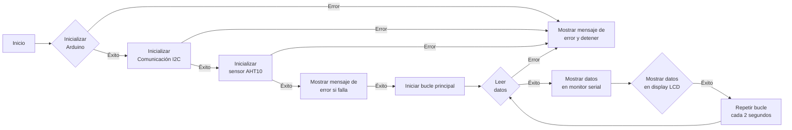
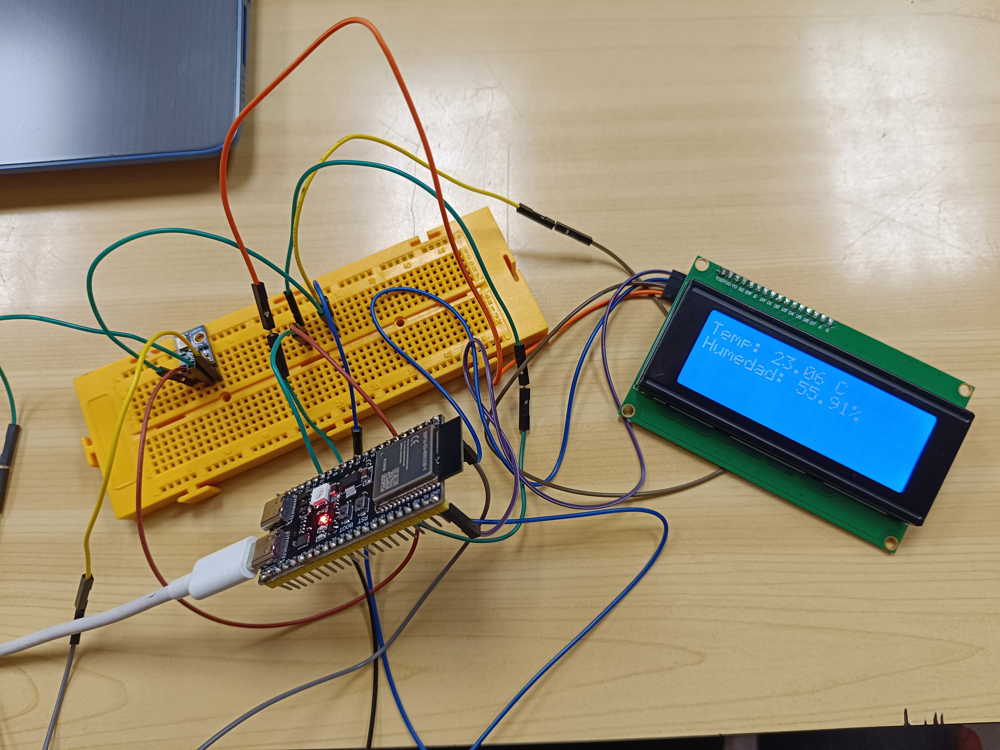
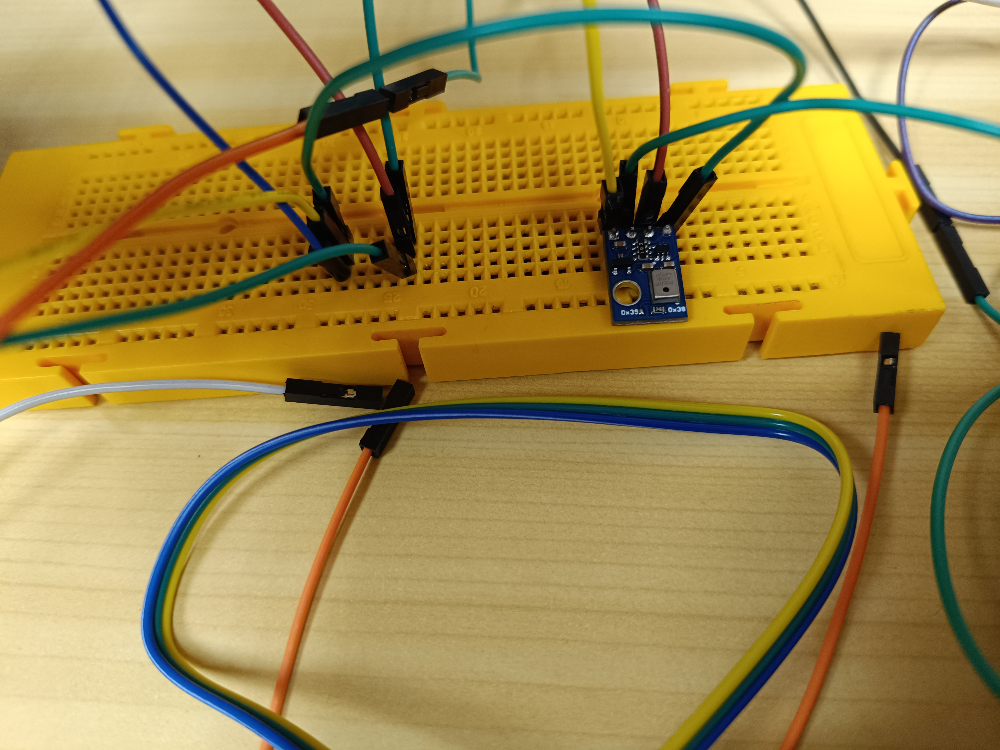
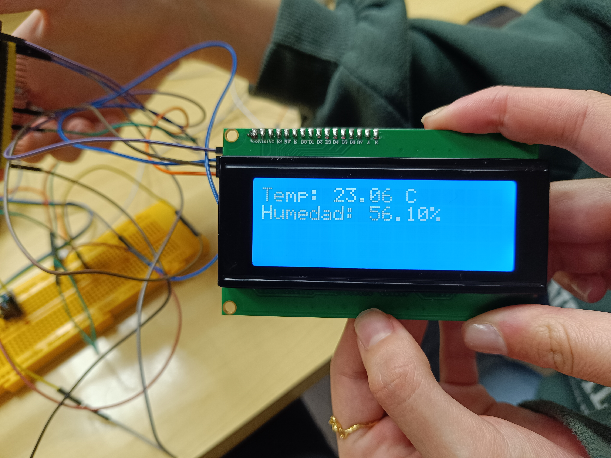

# P5.C. Sensor de temperatura y humedad & display LEDs orgànicos. 
# Objetivos: 
- El objetivo de la practica es comprender el funcionamiento de los buses sistemas de comunicación entre
periféricos; estos elementos pueden ser internos o externos al procesador.
- Medir la tempertura y la humedad del ambiente a partir de un sensor y imprimir los datos a través de un display de LEDs orgànicos.
# Materiales: 
- ESP32-S3
- Display de LEDs orgànicos (LiquidCrystal)
- Sensor de temperatura y humedad AHT10
- Librerias: 
```
    lib_deps = AHT10
                DHT sensor library
                LiquidCrystal_I2C 
```
# Procedimiento: 
**Codigo:**
```cpp
    #include <Arduino.h>
    #include <Wire.h>
    #include <AHT10.h>
    #include <LiquidCrystal_I2C.h>
    #include <Adafruit_Sensor.h>

    AHT10 aht10;
    LiquidCrystal_I2C lcd(0x27, 16, 2); // Dirección I2C y dimensiones del display LCD

    void setup() {
    Serial.begin(115200);
    Wire.begin(); // Inicializa la comunicación I2C
    lcd.init();   // Inicializa el display LCD
    lcd.backlight();
    
    if (!aht10.begin()) {
        Serial.println("Error al inicializar el sensor AHT10");
        while (1);
    }
    }

    void loop() {
    delay(2000); // Espera 2 segundos entre lecturas
    
    float temp = aht10.readTemperature(); // Lee la temperatura en Celsius
    float hum = aht10.readHumidity();     // Lee la humedad relativa
    
    // Imprime los datos en el monitor serial
    Serial.print("Temperatura: ");
    Serial.print(temp);
    Serial.print(" °C\t");
    Serial.print("Humedad: ");
    Serial.print(hum);
    Serial.println("%");

    // Imprime los datos en el display LCD
    lcd.clear();
    lcd.setCursor(0, 0);
    lcd.print("Temp: ");
    lcd.print(temp);
    lcd.print(" C");

    lcd.setCursor(0, 1);
    lcd.print("Humedad: ");
    lcd.print(hum);
    lcd.print("%");
    }
```
**Descripción:**<br>
La principal característica del I2C es su capacidad para permitir la comunicación entre múltiples dispositivos utilizando solo dos cables: uno para la transmisión de datos (SDA) y otro para la sincronización de señales (SCL).<br>
El bus I2C se basa en un maestro y uno o varios esclavos. El maestro inicia y controla las comunicaciones, mientras que los esclavos responden a las solicitudes del maestro. La comunicación en el bus I2C se realiza en forma de tramas de datos, donde cada trama contiene una dirección de dispositivo y los datos correspondientes. Esto permite que múltiples dispositivos compartan el mismo bus y se comuniquen entre sí de manera secuencial. En este proyecyo, utilizamos la biblioteca Wire de Arduino para implementar la comunicación I2C. La función ``Wire.begin()`` inicializa la comunicación I2C, permitiendo que el Arduino actúe como el maestro en el bus. Posteriormente, se configura y se inicializa un sensor de temperatura y humedad (AHT10) y un display LCD (LiquidCrystal_I2C) para la lectura y la visualización de datos respectivamente.<br>
En el bucle principal del programa, se realiza la lectura de temperatura y humedad del sensor AHT10 y se muestran estos datos tanto en el monitor serial como en el display LCD. Para la transmisión de datos al display LCD a través del bus I2C, se utilizan métodos proporcionados por la biblioteca LiquidCrystal_I2C, como ``lcd.clear()``, ``lcd.setCursor()`` y ``lcd.print()``.

### Diagrama de flujos: 

### Salida por el puerto serie: 
```
    Temperatura: 22.99 °C   Humedad: 55.91%
    Temperatura: 22.99 °C   Humedad: 55.83%
    Temperatura: 22.99 °C   Humedad: 55.78%
    Temperatura: 22.99 °C   Humedad: 55.70%
    Temperatura: 22.98 °C   Humedad: 55.65%
    Temperatura: 22.98 °C   Humedad: 55.63%
```
### Fotos del montaje: 
Montaje completo: <br>
 <br>
El sensor: <br>
 <br>
El display: <br>
 <br>

##  Conclusión: 
Lee la temperatura y la humedad de un sensor AHT10 y mostrar estos datos en un display LCD mediante comunicación I2C. 